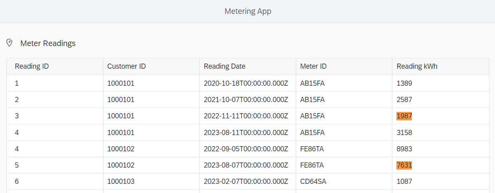

# Take-Home-Exercise für BewerberInnen als Entwickler

## Die Anwendung

Im Rahmen dieser Aufgabe soll eine vorgegebene Client-/Server-Anwendung erweitert werden.

Diese Anwendung simuliert eine simple Zählerdaten-Anzeige, die ihre Daten aus dem Backend enthält.

Hierzu werden die Daten aus einer CSV-Datei zu Beginn des Server-Starts geladen.

Ein einzelner Zählerdaten-Messwert sieht in der Kommunikation mit dem Frontend als JSON-Objekt folgendermaßen aus:

```json
{
  "id": "1",
  "customer_id": "1000101",
  "reading_date": "2020-10-18T00:00:00.000Z",
  "meter_id": "AB15FA",
  "meter_reading": "1389"
}
```

## Voraussetzungen

1. nodeJS installieren
2. `npm install` in diesem Verzeichnis ausführen
3. `npm run start` ausführen um die Anwendung zu starten
4. Im Browser `http://localhost:3000/webapp/index.html` ansteuern

## Ziel der Aufgabe

Im Frontend sollen fehlerhafte Messwerte farblich gekennzeichnet werden. Ein Messwert gilt als fehlerhaft, wenn es für den gleichen Kunden und Zähler bereits einen höheren Messwert in der Vergangenheit gab.

Die Lösung sollte ähnlich wie die untenstehende Abbildung aussehen, wenn die Daten korrekt analysiert und vom Backend geschickt werden.



Fehlerhafte Messwerte werden in der UI5-Anwendung mit einem bestimmten Attritbut versehen, sodass diese farblich hervorgestellt werden. Dies ist bereits mit folgender CSS-Regel implementiert:

```css
span[data-status="Warning"] {
  background: #ff9933;
}
```

Dieses Attribut wird vom Frontend bereits gesetzt, wenn ein Messwert in der Property `status` den Wert `Warning` gesetzt hat. Ein fehlerhafter Messwert würde in der Kommunikation im JSON-Format also folgendermaßen aussehen:

```json
{
  "id": "1",
  ...
  "status": "Warning"
}
```

In allen anderen Fällen soll der Status `Okay` gesetzt werden.

Ihre Aufgabe besteht nun darin im Server die Daten innerhalb der Funktion `function analyzeData(aData)` entsprechend zu analysieren und ggf. den Wert `status: "Warning"` zu setzen.

## Abgabe

Die BewerberInnen werden darum gebeten Ihre Lösung mittels eines Pull Requests auf dieses Repository einzureichen.
